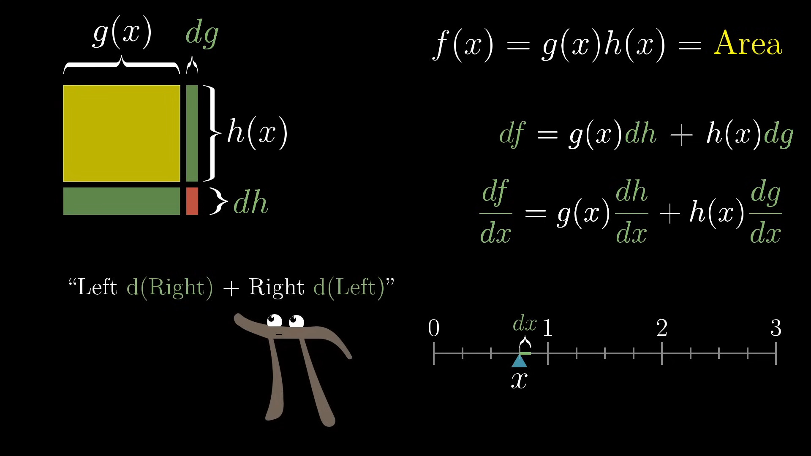

---
tags:
  - mathematics
  - calculus
  - differentiation
---
The various "rules" of elementary differentiation are often taught by rote. With little in the way of meaningful intuition, these become blunt tools, easy to use but even easier to forget, and which in the end teach one essentially nothing about mathematics.

When we teach students to "bring the exponent down, subtract one from it," the **Power Rule**, they memorize this meaningless operation with no regard for *why* this should be the case. This is especially true when revealing that the power rule extends to rational exponents, a fact usually given without proof.

## A simple visual proof of the product rule

That's it. In one video frame, Grant Sanderson does what my calculus professors failed to. The product of two functions $g\left(x\right)$ and $h\left(x\right)$ can be thought of as the rectangular area whose side lengths are the function values. A small increase in $x$, $\dd x$, results in small increases to the function values, and thus the side lengths, which we can write as $\dd g$ and $\dd h$.

The question we want to answer is how the product function $f\left(x\right) = g\left(x\right) h\left(x\right)$ changes per unit change in $x$: the **derivative** of $f$ with respect to $x$. We can rephrase that question now as asking how the area of the above rectangle changes for small changes in $x$.

There are three rectangular pieces to the newly added area $\dd f$, whose areas we can clearly identify as $g\left(x\right) \dd h$, $h\left(x\right) \dd g$, and $\dd g \dd h$. Since the two differentials in the third term are proportional to $\dd x$, the whole term is proportional to ${\dd x}^2$. Thus, when we divide by $\dd x$ and let $\dd x \rightarrow 0$, this term will tend to zero. This leaves us with the two longer rectangles, which only depend on $\dd x$ once, giving us
$$\frac{\dd f}{\dd x} = g\left(x\right) \frac{\dd h}{\dd x} + h\left(x\right) \frac{\dd g}{\dd x},$$
which is the product rule!

## The power rule falls right out

Consider the case when $g\left(x\right) = x$ and $h\left(x\right) = x$. This, of course, means we're trying to find the derivative of $f\left(x\right) = x^2$. Apply the product rule above.
$$\frac{\dd f}{\dd x} = x \frac{\dd h}{\dd x} + x \frac{\dd g}{\dd x}$$
Since $g$ and $h$ are linear, their derivatives are each trivially equal to one.
$$\frac{\dd}{\dd x} x^2 = 2x$$
Inductively, this gives us the power rule for $x^3$, $x^4$, etc.

### A counting argument
### What about rational exponents?

## References
[3Blue1Brown: Derivative formulas through geometry | Chapter 3, Essence of calculus](https://youtu.be/S0_qX4VJhMQ?si=av5A1FAu_t_Bkh3A)
[3Blue1Brown: Visualizing the chain rule and product rule | Chapter 4, Essence of calculus](https://youtu.be/YG15m2VwSjA?si=dtz81k83G7_OLcWV)